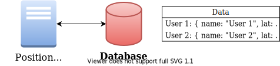

<h1 align="center">
  <br />
  @openhps/solid
</h1>
<p align="center">
    <a href="https://github.com/OpenHPS/openhps-solid/actions/workflows/main.yml" target="_blank">
        
    </a>
    <a href="https://codecov.io/gh/OpenHPS/openhps-solid">
        
    </a>
    <a href="https://codeclimate.com/github/OpenHPS/openhps-solid/" target="_blank">
        
    </a>
    <a href="https://badge.fury.io/js/@openhps%2Fsolid">
        
    </a>
</p>

<h3 align="center">
    <a href="https://github.com/OpenHPS/openhps-core">@openhps/core</a> &mdash; <a href="https://openhps.org/docs/solid">API</a>
</h3>

<br />

In a normal positioning system the developer is meant to store the position to a database. This database allows persisting a users location for tracking purposes or aiding the positioning system with historical information. With such a set-up the user is not aware how they are being tracked and what information is stored.



Solid is a specification that lets people store their data securely in decentralized data stores called Pods. Pods are like secure personal web servers for your data. OpenHPS leverages Solid to store ```DataObject```s and ```DataFrame``s that contain private position information and other sensor data. Any data objects belonging to a certain person will be stored in the decentralized Pod owned by that user.


On top of this, Solid supports linked data to offer a semantic storage of the data. OpenHPS can output data that can not only be used by OpenHPS - but also other positioning systems who know the vocabulary.


These two features combined not only offer more awareness for users on how they are being tracked, but it also enables hybrid positioning between multiple (different) positioning systems.

## Getting Started
If you have [npm installed](https://www.npmjs.com/get-npm), start using @openhps/solid with the following command.
```bash
npm install @openhps/solid --save
```

## Usage

### WebID
@openhps/solid adds a new typed parameter to ```DataObject```s and ```DataFrame```s for the [WebID](https://solidproject.org/faqs#what-is-a-webid) of a user.

**```DataObject```**
```typescript
import { DataObject } from '@openhps/core';

const phone = new DataObject("myphone");
phone.webId = "https://maximvdw.solidweb.org/profile/card#me";
```

The WebID identifies that this object or data frame is owned by a particular user or organization and should be stored in their Pod.

**```Dataframe```**
```typescript
import { DataFrame } from '@openhps/core';

const frame = new DataFrame();
frame.webId = "https://maximvdw.solidweb.org/profile/card#me";
```

### Authentication

### Client
Regardless if you are implementing the positioning system on a client or server, the system will be a client for whatever Pod server a user is using.

#### Node.js
```typescript
ModelBuilder.create()
    .addService(new SolidDataClient({
        loginPath: "/login",
        redirectPath: "/redirect",
        redirectUrl: "http://localhost:3030/redirect",
        loginSuccessCallback: (req: express.Request, res: express.Response, sessionInfo: any) => {
            res.send("OK " + JSON.stringify(sessionInfo));
        },
        loginErrorCallback: (req: express.Request, res: express.Response, sessionInfo: any, reason: any) => {
            res.send("error: " + reason);
        }
    }).createServer(3030))
    .from()
    .to()
    .build();
```

### Storage
Data objects and data frames of generic or specific types can be stored using the ```SolidDataDriver```. This driver uses the
```SolidDataClient```.

```typescript
ModelBuilder.create()
    .addService(new SolidDataClient({
        /* ... */
    }))
    .addService(new DataObjectService(new SolidDataDriver(DataObject)))
    .addService(new DataFrameService(new SolidDataDriver(DataFrame)))
    .from()
    .to()
    .build();
```

## Contributors
The framework is open source and is mainly developed by PhD Student Maxim Van de Wynckel as part of his research towards *Hybrid Positioning and Implicit Human-Computer Interaction* under the supervision of Prof. Dr. Beat Signer.

## Contributing
Use of OpenHPS, contributions and feedback is highly appreciated. Please read our [contributing guidelines](CONTRIBUTING.md) for more information.

## License
Copyright (C) 2019-2021 Maxim Van de Wynckel & Vrije Universiteit Brussel

Licensed under the Apache License, Version 2.0 (the "License"); you may not use this file except in compliance with the License. You may obtain a copy of the License at

https://www.apache.org/licenses/LICENSE-2.0

Unless required by applicable law or agreed to in writing, software distributed under the License is distributed on an "AS IS" BASIS, WITHOUT WARRANTIES OR CONDITIONS OF ANY KIND, either express or implied. See the License for the specific language governing permissions and limitations under the License.